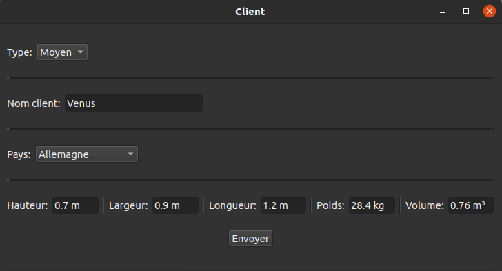

# Exigences
voir les fichiers CMakeLists.txt

# Compilation
Ce programme a été écrit en C++ dans le cadre d'un projet de classe.
Les codes peuvent être compilés avec les fichiers CMakeLists.txt avec cmake_minimum_required(VERSION 3.5).

# Exécution & Résultats
Ce programme permet d'envoyer des colis depuis la partie client vers la partie serveur.
Le serveur réceptionne un colis et le charge dans un camion en fonction de sa destination.

L'interface utilisateur de la partie client affiche les informations du colis à envoyer.

L'interface utilisateur de la partie serveur affiche la liste des colis chargés dans chaque camion.

Les projets "serveurLivraison" et "clientLivraison" fonctionnent ensemble. Il faut exécuter "serveurLivraison" en premier afin de démarrer le serveur.

Les projets "serveurLivraison_libColisStatique" et "clientLivraison_libColisStatique" fonctionnent ensemble; ils utilisent la bibliothèque statique "libColisStatique.a" qui est construite après compilation du projet "ColisStatique". Il faut exécuter "serveurLivraison_libColisStatique" en premier afin de démarrer le serveur.

La documentation Doxygen de chaque projet est consultable:
- [clientLivraison](./clientLivraison/html/index.html),
- [serveurLivraison](./serveurLivraison/html/index.html),
- [clientLivraison_libColisStatique](./clientLivraison_libColisStatique/html/index.html),
- [serveurLivraison_libColisStatique](./serveurLivraison_libColisStatique/html/index.html),
- [ColisStatique](./ColisStatique/html/index.html).
